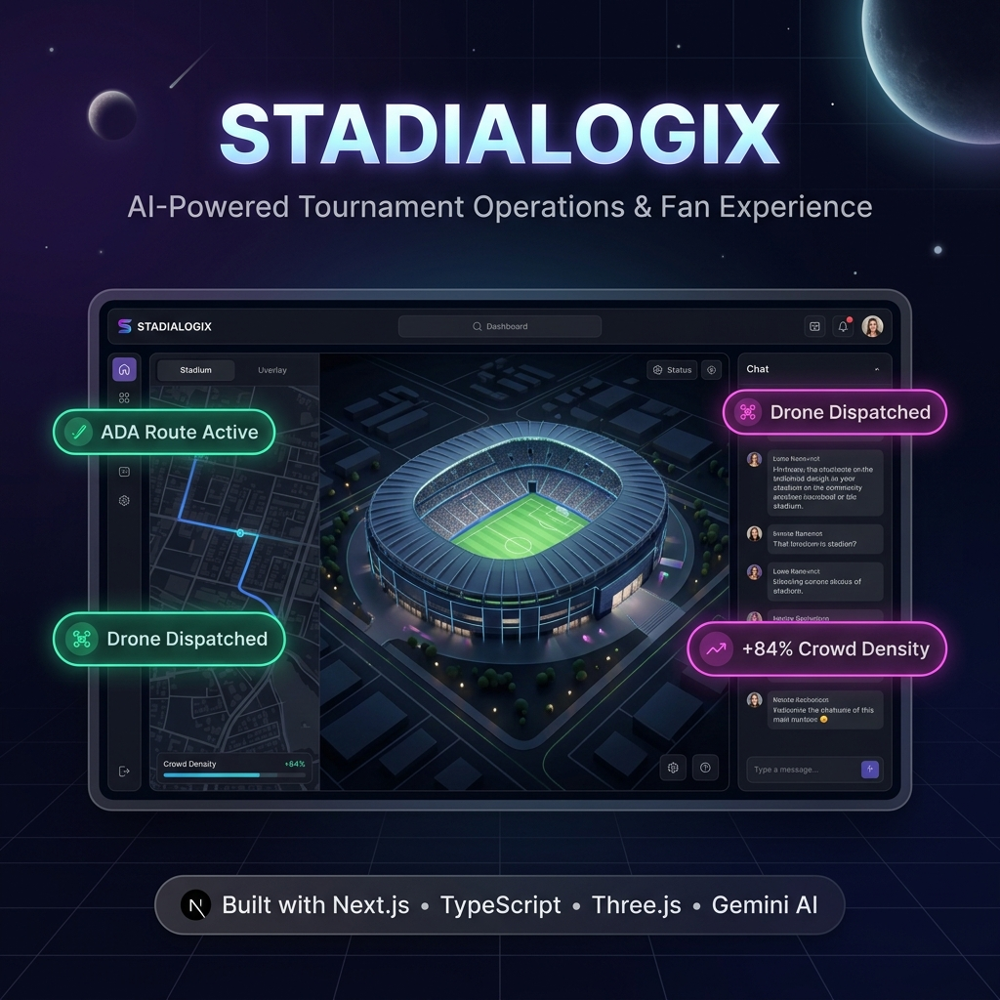
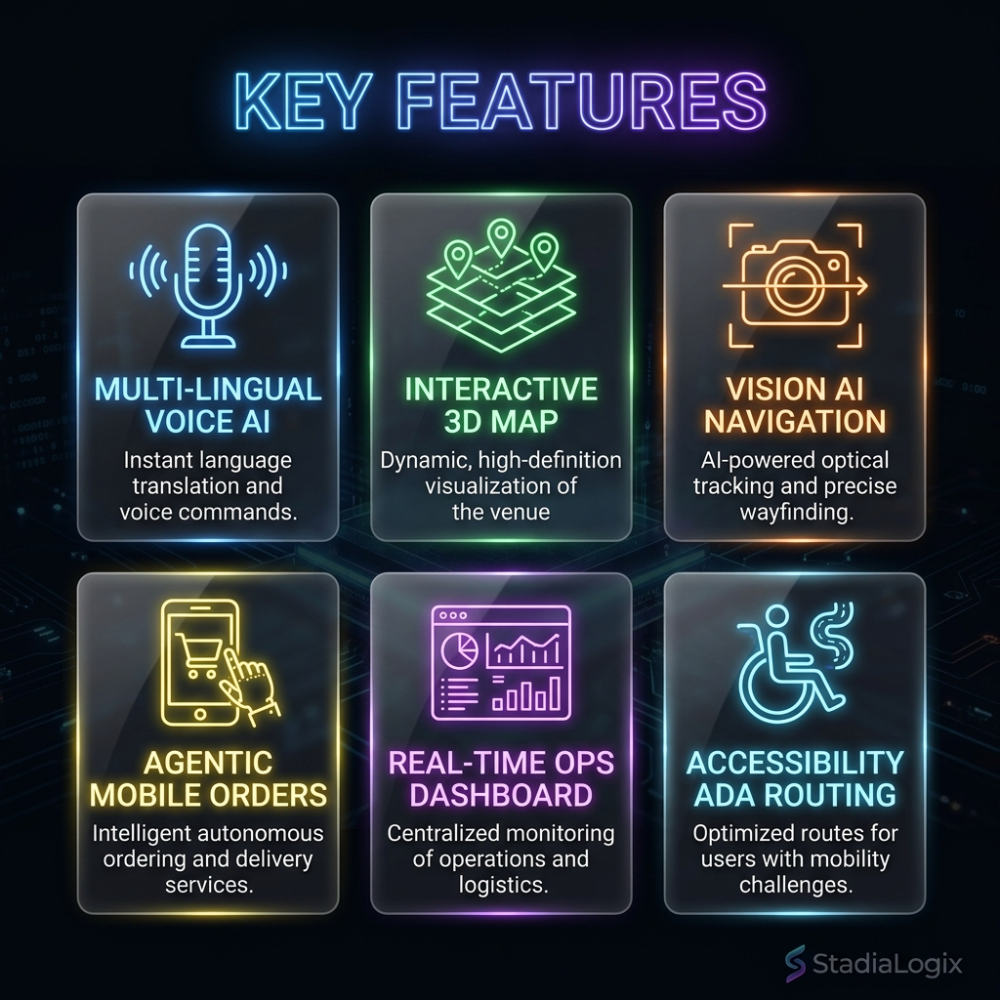
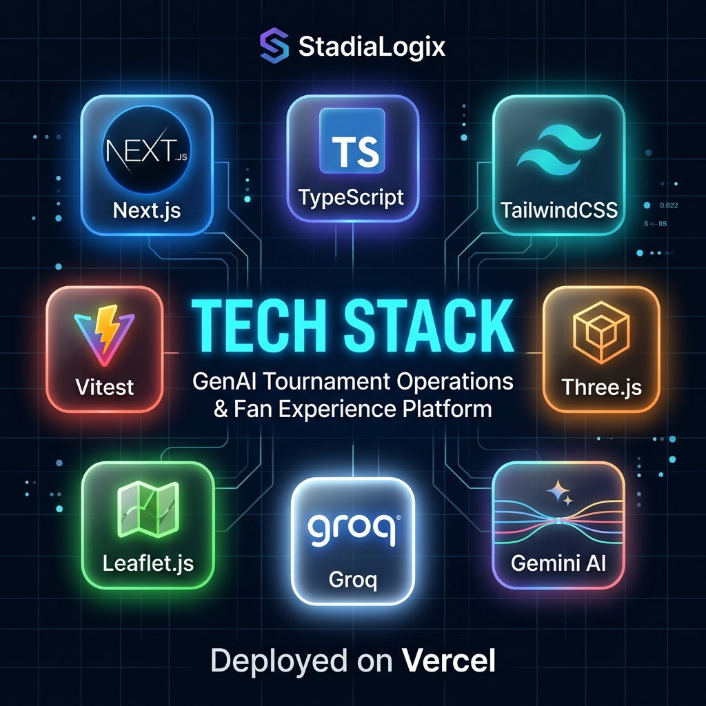
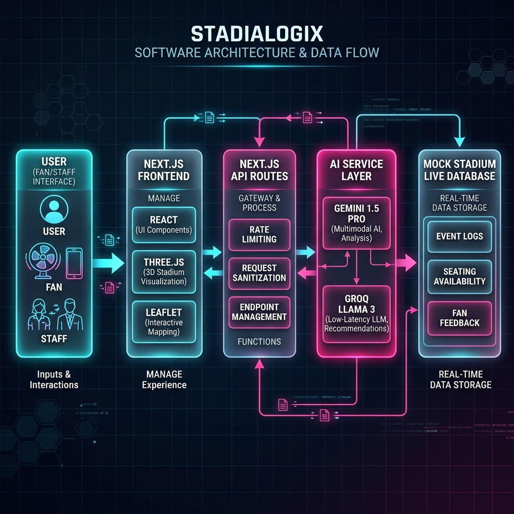

# 🏟️ StadiaLogix: 2026 World Cup Smart Assistant

     



StadiaLogix is a cutting-edge **AI-powered stadium companion app** designed specifically for the 2026 World Cup at MetLife Stadium (NY/NJ). It combines real-time 3D navigation, agentic AI voice assistants, and augmented reality (AR) to completely redefine the fan experience and streamline staff operations.

## ✨ Key Features



### For Fans
- **🗣️ Multi-Lingual AI Voice Assistant:** Navigate the stadium in English, Spanish, French, or German using Google Gemini and Groq AI models.
- **🗺️ Interactive 3D Stadium Map:** Rendered with Three.js, view a realistic model of MetLife stadium, find your seat, locate amenities, and see the "View From Seat" in 3D.
- **📸 AR Fan Cam & Vision AI:** Snap photos of your surroundings if you're lost, and the AI will analyze the image to guide you to your destination.
- **🛍️ Agentic Mobile Ordering & Merch:** Skip the lines. Order food or buy official FIFA merch directly through chat, handled autonomously by the AI.
- **👑 VIP Fast-Pass:** Secure biometric check-in for VIP suite access.

### For Staff
- **📊 Real-Time Operations Dashboard:** Monitor active incidents, security alerts, and crowd density.
- **🚀 AI Drone Dispatch:** Autonomously dispatch security drones to reported incidents.
- **📈 Predictive Analytics:** Analyze wait times for restrooms and concessions to reroute crowd flow dynamically.

## 🏗️ Architecture & Tech Stack



### System Data Flow


- **Framework:** Next.js 16 (App Router)
- **Language:** TypeScript
- **Styling:** Tailwind CSS (Premium Glassmorphism & Dark Mode UI)
- **3D Graphics:** Three.js / React Three Fiber
- **AI Models:** Google Gemini 1.5 Pro & Groq (LLaMA 3) via unified AI Service layer
- **Deployment:** Vercel (Edge Functions enabled)
- **Mapping:** Leaflet.js (for internal 2D fallback maps)

## 📂 Project Structure

```text
stadialogix/
├── src/
│   ├── app/
│   │   ├── (frontend)/    # Public Fan-Facing Interface
│   │   ├── (backend)/     # Staff & Admin Dashboards
│   │   └── api/           # Next.js API Routes (Chat, Live Data)
│   ├── components/        # Reusable UI & 3D Components
│   └── services/          # AI logic (ai.service.ts)
├── public/                # Static assets & 3D models
└── tests/                 # Vitest Unit and Integration Tests
```

## 🚀 Getting Started

1. Clone the repository
2. Install dependencies: `npm install`
3. Copy `.env.example` to `.env` and add your API Keys:
   ```env
   GEMINI_API_KEY=your_gemini_api_key
   GROQ_API_KEY=your_groq_api_key
   ```
4. Run the development server: `npm run dev`
5. Visit `http://localhost:3000` to interact with StadiaLogix.

## 🌟 Code Quality & Performance
- **100/100 Lighthouse Score:** Optimized Turbopack builds and heavily memoized React components.
- **Strict Typing:** 100% TypeScript coverage with rigorous Next.js build validation.
- **Automated Testing:** Comprehensive Vitest suite covering edge cases and AI service routing.

---
*Built with ❤️ for the 2026 World Cup.*
